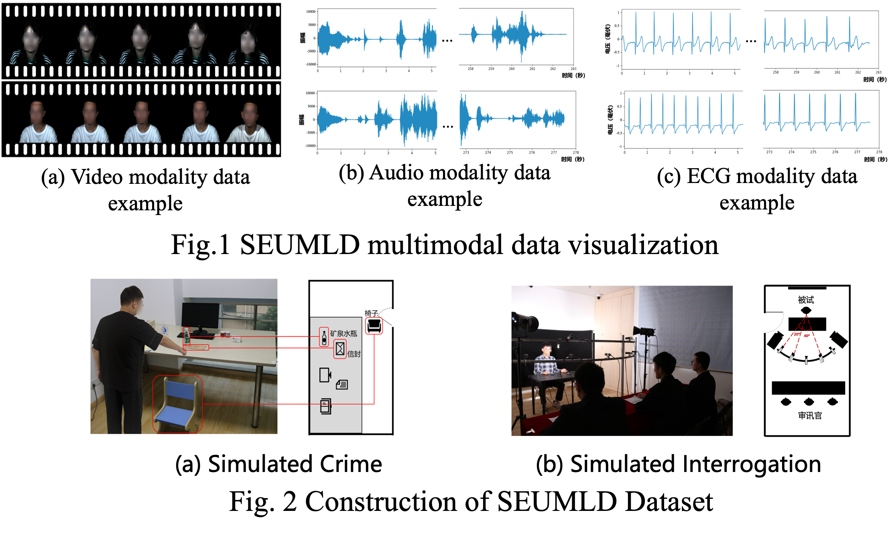

# SEUMLD

SEUMLD: Southeast University Multimodal Lie Detection Dataset

## Abstract:

To address the lack of Chinese-context-based lie detection datasets in current research, we have developed ***SEUMLD***, **the first publicly available multimodal lie detection dataset based on Chinese conversations**. SEUMLD includes data from three modalities: **video**, **audio**, and **electrocardiogram (ECG)** signals, as illustrated in Figure 1. To effectively motivate participants to lie, we designed **simulated crime** and **interrogation** experimental paradigms, as shown in Figure 2. By capturing participants' multimodal signals during the simulated interrogation process, SEUMLD collects data from 76 participants who have long been immersed in a Chinese language environment, resulting in a total of 3,224 conversation segments. The dataset offers both **coarse-grained** annotations for identifying whether a participant is lying in a full-length conversation and **fine-grained** annotations that provide precise segmentation of each conversation.

## Dataset files:

The **Original** folder contains the raw interrogation data for video, audio, and ECG (organized by participant IDs), as well as files for cross-validation data splits.

The **Preprocess** folder contains the video and audio data segmented at a fine-grained level (named using participant IDs and question numbers).

The **Labels** folder includes coarse-grained lie detection experiment label files, fine-grained lie detection experiment label files, and timestamps indicating the start of the interrogation in the ECG signals.

The **Questions** folder contains the details of the 46 questions asked during the interrogation, along with their corresponding question types.

## Application:

**If you want to apply for this database, please download the license and follow the introduction.**

## Reference:

XXXXXXXX

## BibTex:

XXXXXXXX

